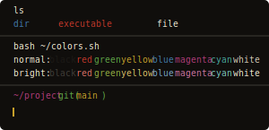
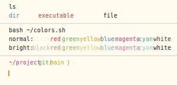

# Flynt for Warp

Warm tones. Zero visual noise. - [Flynt](https://flynt-theme.github.io/flynt) for [Warp](https://www.warp.dev).

<table align="center" border="0" cellspacing="0" cellpadding="8"><tr>
  <td></td>
  <td></td>
</tr></table>

## Install

1. Copy the theme files into `~/.warp/themes/` (create it if it doesn't exist):

   ```sh
   mkdir -p ~/.warp/themes
   cp themes/flynt-dark.yaml ~/.warp/themes/
   cp themes/flynt-light.yaml ~/.warp/themes/
   ```

2. Open Warp - Settings - Appearance - Theme and select **Flynt Dark** or **Flynt Light**.

## Building from source

Themes are generated from [`theme.yaml.tmpl`](theme.yaml.tmpl) using [strike](https://github.com/flynt-theme/strike).

```sh
brew tap flynt-theme/tap && brew install strike
strike build theme.yaml.tmpl --out themes/
```

## License

MIT - [Flynt Theme](https://github.com/flynt-theme)
